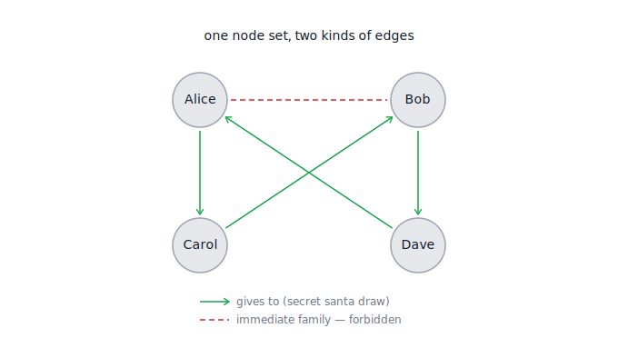
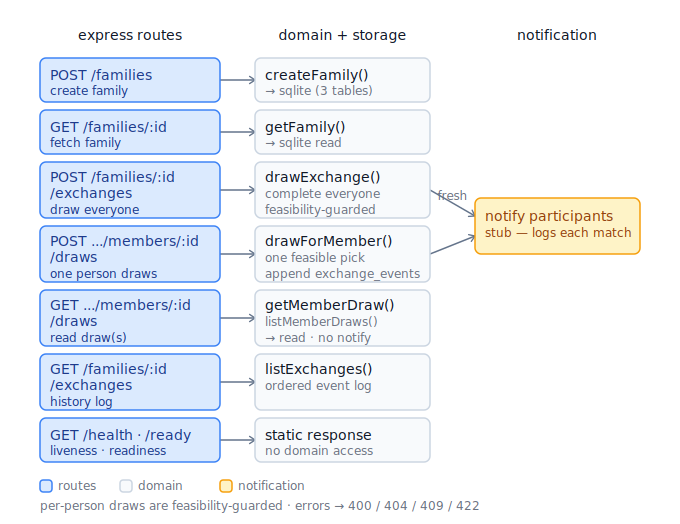
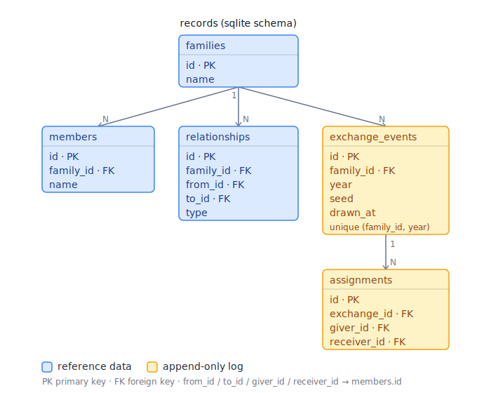

# Secret Santa

# Problem Statement

There are many many different ways to solve this problem. What we are looking for is good code and good software design (it’s up to you to decide what that is). We expect this will take you somewhere around 2-4 hours to complete, so we aren’t expecting “perfect” code (if there is such a thing). If you find yourself stuck or spending too much time on the problem, send us what you have with an explanation of what you planned on doing for the rest of your solution.

Here are a few things to keep in mind:

Your code should be easily readable, commented, and maintainable.

If you need to store data, using an in memory “database” is OK (simple Collections are fine), though you may choose to do something different.

Your application may be viewed by many users at the same time.

Include unit tests to validate your application’s functionality (edge cases, normal operation, etc). You don’t need 100% code coverage.

Feel free to use any build tools and/or libraries you are comfortable with. Please document how to build/run your solution.

Please upload your solution to GitHub as a public repository and send us the link, or invite us to a private repo if you’d prefer.

## Part One

Imagine that every year your extended family does a "Secret Santa" gift exchange. For this gift exchange, each person draws another person’s name at random and then gets a gift for them (a person cannot be their own Secret Santa). Write a program that will choose a Secret Santa for everyone given a list of all the members of your extended family.

## Part Two

After the third year of having the Secret Santa gift exchange, you’ve heard complaints of having the same Secret Santa year after year. Modify your program so that a family member can only have the same Secret Santa at most once every 3 years.

## Part Three

As your extended family has grown, members have gotten married and/or had children. Those families usually get gifts for members of their immediate family, so it doesn’t make sense for anyone to be a Secret Santa for a member of their immediate family (spouse, parents, or children). Modify your program to take this constraint into consideration when choosing Secret Santas.

# Design

A service that draws a Secret Santa for everyone in an extended family, honouring three
rules that build on each other:

1. **No self-draws** — nobody is their own Secret Santa.
2. **No recent repeats** — a giver→receiver pairing can recur at most once every 3 years.
3. **No immediate family** — nobody is Secret Santa for their spouse, parents, or children.

It's a small problem deliberately built the way I'd build a piece of a data platform:
a pure, well-tested core; storage behind a swappable port (a real SQL database, not a
`Map`); an append-only event log for history; idempotent writes; and a pluggable
notification hook.

## How it works (the one idea)

All three parts are the **same problem**: find a random permutation of the family where
every `giver → receiver` edge is allowed. Each rule just forbids some edges. A
**randomized backtracking search** finds a valid assignment if one exists (and proves it
when none does), while a **seeded RNG** keeps the draw random yet reproducible.

The same people form two different graphs: the family relationships (which edges are
_forbidden_) and the Secret Santa draw (a permutation that routes around them):



```
HTTP (Express)  ──►  Service  ──►  Assignment engine (pure, seeded, backtracking)
                       │                 ▲
                       ▼                 │ constraint rules (self / recent-repeat / family)
                 FamilyStore (port)
                       │
                 SQLite adapter  ── append-only exchange_events log
                       │
                       └─ after a fresh draw ──► notification hook (stub: logs each match)
```

## Diagrams

How requests flow through the layers — each route is a thin shell over a domain call, and
only a fresh draw notifies participants:



The records that get persisted (the SQLite schema). Blue tables are reference data; amber
tables are the append-only log. `UNIQUE (family_id, year)` is the idempotency guarantee,
and the `*_id` columns hold `members.id` values (application-enforced references):



## Quick start

Requires **Node 20+**.

```bash
npm install
npm test          # unit, property-based, storage, incremental-draw, API
npm run dev       # start the API on http://localhost:3000 (hot reload)
```

Production build:

```bash
npm run build && npm start
```

Config is via env vars — see [.env.example](.env.example) (`PORT`, `DB_FILE`, `LOG_LEVEL`);
copy it to `.env` and run with `node --env-file=.env`, or just export them. The SQLite file
is created automatically at `data/secret-santa.db`. Tests use an in-memory database, so they
never touch disk.

### IntelliJ IDEA / WebStorm

**One-time setup:** point the IDE at a Node interpreter once — _Settings → Languages &
Frameworks → Node.js → Node interpreter_. If Node is managed by **nvm**, pick the version
there (or use its absolute path, e.g. `~/.nvm/versions/node/v20.x.x/bin/node`). This is
required because a desktop-launched IDE doesn't inherit your shell's `PATH`, so it can't
find `node`/`npm` on its own. The configs use the "project" interpreter, so once it's set
they all work.

Shared run/debug configurations are committed under `.idea/runConfigurations/`, so they
appear in the run dropdown on first open:

- **Dev server (watch)** — `npm run dev`, auto-reloads on changes.
- **Debug server** — `npm run start:dev` (no watch); hit _Debug_ and set breakpoints
  directly in the `.ts` sources (tsx emits source maps, so they bind). Watch is omitted
  here so a reload never detaches the debugger.
- **Tests** — runs the Vitest suite.

### Try it

```bash
# 1) Create a family (relationships reference members by array index).
#    Here Alice (0) and Bob (1) are spouses.
curl -s -X POST localhost:3000/families -H 'content-type: application/json' -d '{
  "name": "Magorians",
  "members": [{"name":"Alice"},{"name":"Bob"},{"name":"Carol"},{"name":"Dave"}],
  "relationships": [{"fromIndex":0,"toIndex":1,"type":"spouse"}]
}'

# 2a) Draw Secret Santas for the WHOLE family at once for 2026 (use the id above).
#     `seed` is optional — pass one for a reproducible draw.
curl -s -X POST localhost:3000/families/<FAMILY_ID>/exchanges \
  -H 'content-type: application/json' -d '{"year":2026,"seed":7}'

# 2b) ...OR let ONE person draw their own Secret Santa (repeat per member, any order).
#     Each draw is chosen so the rest of the family can still be completed.
curl -s -X POST localhost:3000/families/<FAMILY_ID>/members/<MEMBER_ID>/draws \
  -H 'content-type: application/json' -d '{"year":2026}'

# 3) Read the history (the append-only log).
curl -s localhost:3000/families/<FAMILY_ID>/exchanges

# 4) Ask "who did I draw?" — only this member's receiver, so the secret is kept.
#    Drop ?year to get the member's whole draw history instead.
curl -s "localhost:3000/families/<FAMILY_ID>/members/<MEMBER_ID>/draws?year=2026"
```

## API

| Method | Path                                    | Description                                                                                               |
| ------ | --------------------------------------- | --------------------------------------------------------------------------------------------------------- |
| `POST` | `/families`                             | Create a family. Returns the family with generated ids.                                                   |
| `GET`  | `/families/:id`                         | Fetch a family.                                                                                           |
| `POST` | `/families/:id/exchanges`               | Draw for **everyone** not yet drawn for `{ year, seed? }` (also completes a partial year).                |
| `POST` | `/families/:id/members/:memberId/draws` | **One person** draws their own Secret Santa for `{ year, seed? }`. Idempotent per member.                 |
| `GET`  | `/families/:id/members/:memberId/draws` | A member's own draw — `?year=YYYY` for that year's receiver (404 if not drawn), or every year if omitted. |
| `GET`  | `/families/:id/exchanges`               | The exchange history, oldest first.                                                                       |
| `GET`  | `/health`, `/ready`                     | Liveness / readiness probes.                                                                              |

Two ways to draw, sharing one exchange per year:

- **Bulk** (`POST .../exchanges`) computes a Secret Santa for everyone who hasn't drawn yet.
- **Per-person** (`POST .../members/:memberId/draws`) lets each person draw their own name,
  in any order. Every draw is **feasibility-guarded**: the recipient is chosen so a valid
  assignment for the rest of the family still exists, so no one is ever forced to draw
  themselves or a relative — the classic "hat" dead-end can't happen. Each per-person draw
  returns `{ giverId, receiverId, complete }`; the two modes interoperate (you can start
  per-person and finish with a bulk call, or vice-versa).

Errors return a stable shape: `{ "code": "...", "message": "..." }`. Notable codes:
`VALIDATION_ERROR` (400), `FAMILY_NOT_FOUND` / `MEMBER_NOT_FOUND` / `DRAW_NOT_FOUND` (404),
`MEMBER_ALREADY_DREW` (409), `NO_VALID_ASSIGNMENT` (422 — over-constrained, or no recipient
keeps the draw completable).

Re-`POST`ing a year that's already been drawn returns the **existing** result with `200`
(a fresh draw returns `201`) and does not re-notify anyone.

## Notifications

After a fresh draw, the API calls a small **notification hook** that announces each
pairing to its giver. The shipped implementation is a stub that logs via the structured
logger ([src/notifier.ts](src/notifier.ts)) — it's the seam where a real email/SMS/push
integration, or an enqueue onto a durable queue, would slot in. It's deliberately
best-effort: the draw is already persisted before the hook runs, so a notification failure
is logged rather than failing the request, and a duplicate (idempotent) draw never
re-notifies.

## Run with Docker

```bash
docker compose up --build
# API → http://localhost:3000
```

## Testing

```bash
npm test               # run everything once
npm run test:coverage  # with coverage
```

The suite covers:

- **Unit** — the RNG, each constraint rule in isolation, and the assignment engine
  (valid derangements, the 2-person case, single-person failure, immediate-family
  exclusion, recent-repeat avoidance, over-constrained failure, determinism).
- **Property-based** (fast-check) — for _any_ family of 2+ people the engine returns a
  valid derangement, and the same `(family, seed)` always yields the same result.
- **Incremental draw** — each person drawing individually builds one valid derangement;
  draws never dead-end (even in reverse order); idempotent per member; bulk completes a
  partially-drawn year.
- **Storage** — round-trips through SQLite, the append-only log, and the per-member
  `UNIQUE (exchange_id, giver_id)` "draw once" guarantee.
- **API** — happy paths, per-person and bulk draws, idempotency, and every error status.
- **Notifications** — the hook fires once per participant and not at all on a re-draw.

## Project layout

```
src/
  domain/            # pure core — no I/O
    types.ts  rng.ts  family.ts  errors.ts  assigner.ts
    constraints/     # one file per rule
  store/             # FamilyStore port + SQLite adapter + schema
  api/               # Express server, routes, zod schemas, error handler
  notifier.ts        # notification hook + stub (logging) implementation
  exchangeService.ts # ties the engine to the store (the draw use-case)
  index.ts           # composition root + graceful shutdown
tests/               # unit / property / store / api
```

## Scope & future work

Held to the take-home's 2–4 hour target. Designed but intentionally **not built** (each
noted below):

- A `PostgresFamilyStore` (Aurora) — the SQLite schema and queries port directly.
- A real notification transport behind the hook (email/SMS/push), with a durable queue or
  transactional outbox for guaranteed, retried delivery.
- AuthN/Z, rate limiting, and metrics export.
